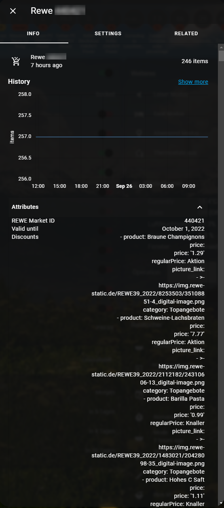

[](https://github.com/hacs/integration)
# Rewe.de Homeassistant Discounts Sensor
Gets discounts and highlights from the [rewe.de API](https://shop.rewe.de/mc/api/markets-stationary).




This integration provides the following informations with a refresh interval of 24 hours until now:


Sensors:

- sensor.marketid: Amount of currently valid offers

Sensor Attributes:

- market_id: Your rewe market id
- valid until: Valid until Discount Date
- discounts: Discounts currently valid
    - attribute product name
    - attribuite discount price
    - attribute picture link

## Installation
### 1. Using HACS (recommended way)

Open your HACS Settings and add

https://github.com/faserf/ha-rewe

as custom repository URL.

Then install the "rewe discounts" integration.

If you use this method, your component will always update to the latest version.

### 2. Manual

- Download the latest zip release from [here](https://github.com/FaserF/ha-rewe/releases/latest)
- Extract the zip file
- Copy the folder "rewe" from within custom_components with all of its components to `<config>/custom_components/`

where `<config>` is your Home Assistant configuration directory.

>__NOTE__: Do not download the file by using the link above directly, the status in the "master" branch can be in development and therefore is maybe not working.

## Configuration

Go to Configuration -> Integrations and click on "add integration". Then search for Rewe.

### Getting the rewe market ID
1. Go to the [REWE Marktsuche](https://www.rewe.de/marktsuche)
2. Enter your city or PLZ and choose your desired REWE
3. Select "Marktinfos"
4. Copy the marked id from the URL


### Configuration Variables
- **market_id**: Enter your rewe market id

### Automations in HA
A full automation example for HA would be:

```yaml
message: >
    Neues Angebot im Rewe Prospekt für
    
    
    

    - {{product.product }}
    Preis: {{product.price.price }} €
    Bild: {{ product.picture_link }}
    
    
```

## Bug reporting
Open an issue over at [github issues](https://github.com/FaserF/ha-rewe/issues). Please prefer sending over a log with debugging enabled.

To enable debugging enter the following in your configuration.yaml

```yaml
logger:
    logs:
        custom_components.rewe: debug
```

## Thanks to
This integration uses the great python code from [Foo-Git Rewe-discounts](https://github.com/foo-git/rewe-discounts)